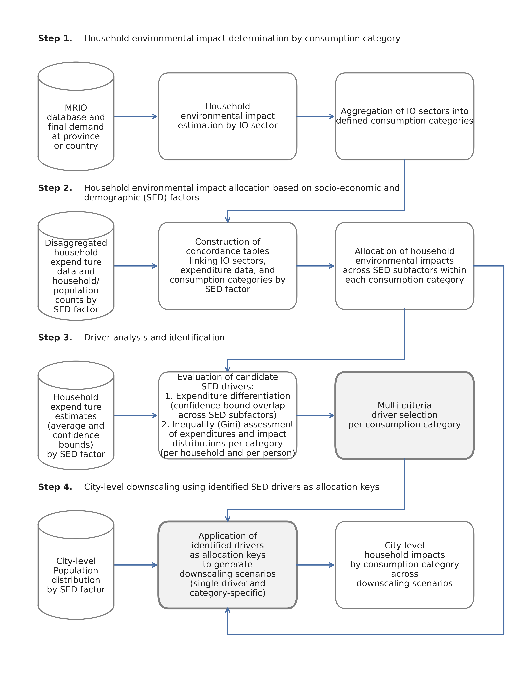

# A category-specific framework for city-level downscaling of household environmental impacts

City-level downscaling of household environmental impacts relies predominantly on a uniform income scaling factor, introducing a systematic allocation bias, as expenditure responses to income differ structurally across categories. This repository presents a four-step framework for systematically comparing socioeconomic and demographic (SED) factors as candidate allocation parameters across consumption categories. The framework is demonstrated using the cities of the Province of Quebec (Canada) as a case study, using 2021 data and Climate Change (short term) as the impact category, and is designed to be transferable and adaptable to other impact categories and regions.  

## Repository structure

The repository is organized in five folders: four corresponding to each step of the framework, and one containing the supplementary material referenced in the manuscript. Each folder contains the corresponding Jupyter notebooks and the description of the required inputs and outputs.

## Citation

https://doi.org/10.5281/zenodo.20331559

Moreno, P., Pedinotti-Castelle, M., & Amor, B. (under review) Beyond uniform income scaling factor: A category-specific EEIO downscaling framework for city-level household impacts under aggregated data constraints. Submitted to the *Journal of Industrial Ecology*.

## Contact

paalo.andrea.moreno.yanez@usherbrooke.ca

## License

This repository is licensed under a [Creative Commons Attribution-ShareAlike 4.0 International License](https://creativecommons.org/licenses/by-sa/4.0/)

- **Share** — copy and redistribute the material in any medium or format.
- **Adapt** — remix, transform, and build upon the material for any purpose, even commercially.
- **Attribution** — You must give appropriate credit, provide a link to the license, and indicate if changes were made.
- **ShareAlike** — If you remix, transform, or build upon the material, you must distribute your contributions under the same license as the original.
